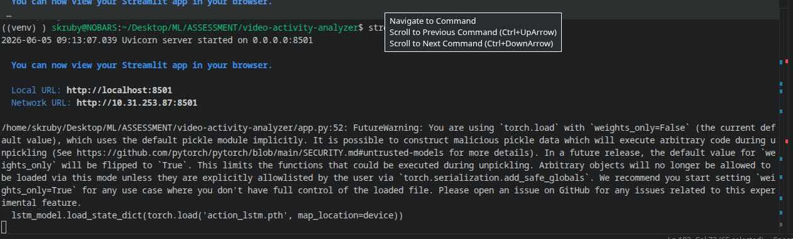
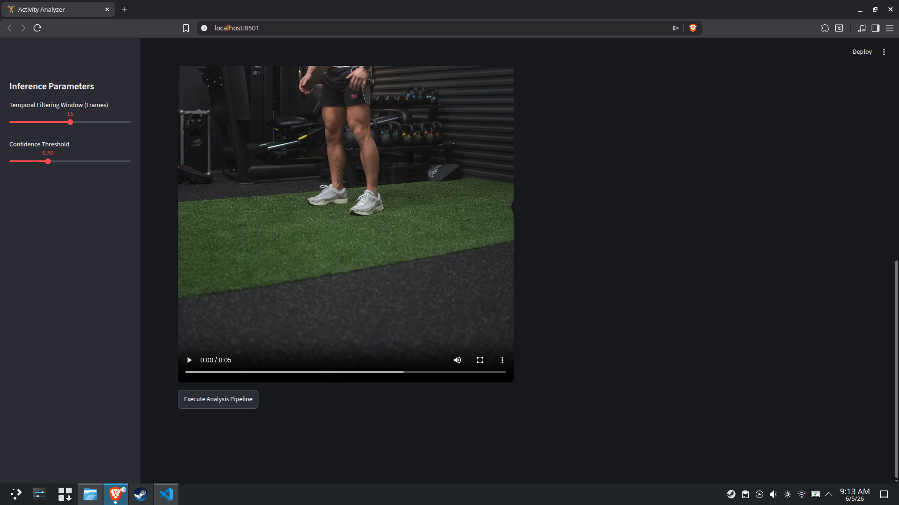
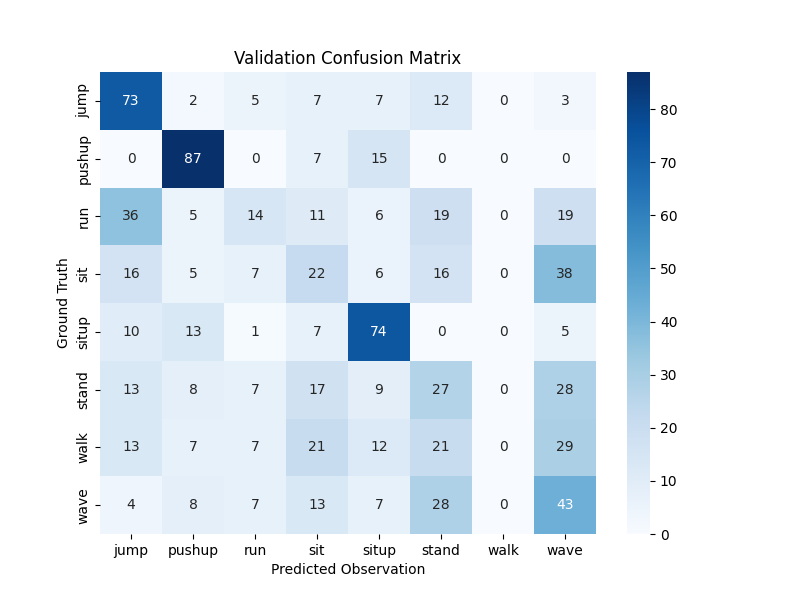
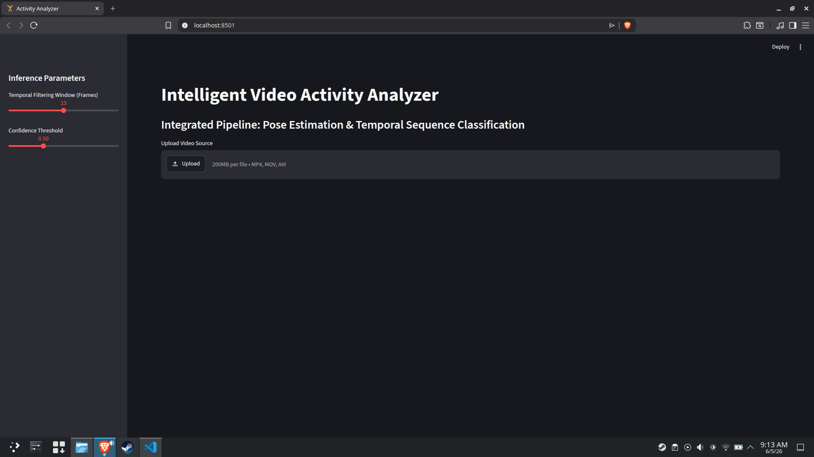
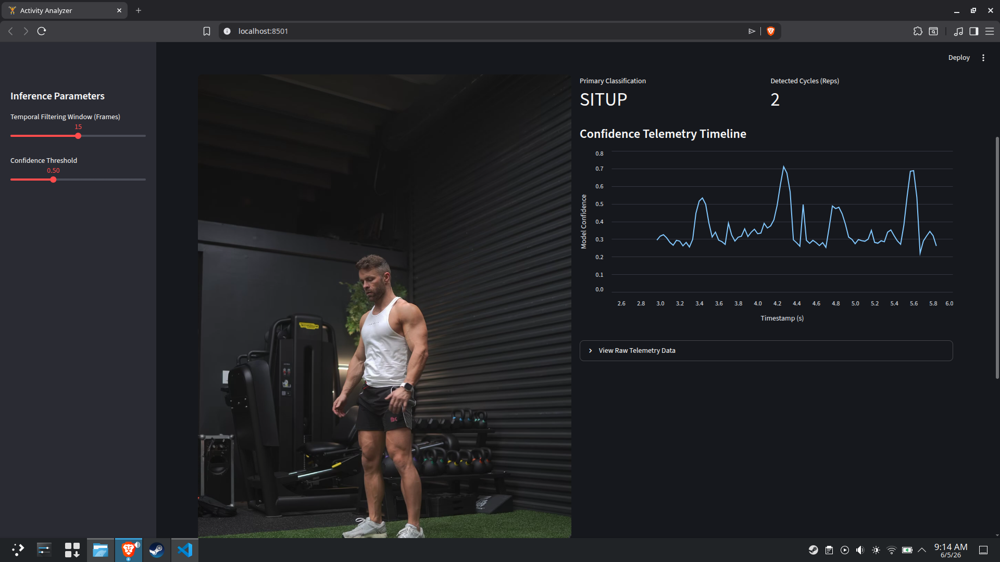

# Intelligent Video Activity Analyzer

## Problem Statement
The objective of this project is to build a robust Machine Learning pipeline capable of classifying human physical activities from short video clips. Rather than relying on computationally heavy 3D ConvNets for raw pixel analysis, the system must extract skeletal features via pose estimation and analyze the temporal sequence of human movement. The final product must deploy as an interactive web application that provides real-time inference, handles tracking noise, and manages severe dataset class imbalances.

## Dataset Information
The dataset consists of video sequences categorized into 8 distinct activity classes: `jump`, `pushup`, `run`, `sit`, `situp`, `stand`, `walk`, and `wave`. 

**Data Challenges Identified:**
* **Severe Class Imbalance:** The raw dataset was highly skewed, with the majority class (`walk`) containing roughly 110 samples, while minority classes (`pushup`, `wave`) contained as few as 21 samples.
* **Variable Temporal Lengths:** Video clips ranged in duration, requiring standardization to a fixed sequence length for recurrent neural network processing.
* **Spatial Variance:** Subjects appeared in various locations across the frame, requiring spatial normalization to prevent the model from memorizing pixel locations instead of joint angles.

## Approach
To build a production-grade system, the pipeline was divided into three core stages:
1. **Feature Extraction:** Utilized **YOLOv8-Pose** to extract 17 key structural joints (X, Y, Confidence) per frame, resulting in a lightweight 51-dimensional array.
2. **Data Engineering (`manage_data.py`):** * **Temporal Padding:** Sequences shorter than 90 frames were padded by repeating the final frame's state to prevent sudden velocity spikes.
   * **Spatial Normalization:** Keypoints were dynamically centered around the frame's $(0,0)$ mean and scaled to ensure spatial invariance.
   * **Augmented Oversampling:** Addressed the class imbalance by synthetically upsampling minority classes to match the majority class. This was achieved via horizontal keypoint negation (flips) and Gaussian jitter injection in memory.
3. **Inference & UI (`app.py`):** Deployed a Streamlit dashboard featuring three **Bonus Capabilities**:
   * **Temporal Smoothing:** A rolling-window mode filter to eliminate UI flickering.
   * **Exercise Repetition Counting:** An edge state-machine that counts cyclic repetitions based on confidence thresholds.
   * **Activity Timeline Visualization:** A Pandas-driven telemetry chart tracking inference over time.

## Model Architecture
The temporal classification engine is built using **PyTorch** and utilizes a Long Short-Term Memory (LSTM) network designed for sequence data.
* **Input Layer:** 51 dimensions (17 YOLO joints $\times$ 3 values).
* **Recurrent Layers:** 2 stacked LSTM layers with a hidden size of 128 nodes to capture complex temporal boundaries.
* **Regularization:** Dropout rate of 0.2 applied between LSTM layers to prevent overfitting on the augmented dataset.
* **Output Layer:** A Fully Connected (Linear) layer mapping the 128 hidden features from the final sequence time-step to the 8 categorical classes.
* **Sequence Length:** Fixed at 90 frames (approx. 3 seconds at 30 FPS).

## Training Process

#install the requirements 

´´´ K ´´´ 

The model was trained on an NVIDIA RTX 3050 GPU.
* **Data Split:** 80% Training, 20% Testing (stratified to ensure equal class representation).
* **Loss Function:** `CrossEntropyLoss`. (Note: Manual class weights were removed after implementing the augmented oversampling pipeline).
* **Optimizer:** Adam optimizer with a learning rate of `0.0002`.
* **Batch Size & Epochs:** Trained with a batch size of 16 for 100 epochs to allow the higher-capacity network to converge smoothly.

## Evaluation Results
*(Note to evaluator: The pipeline focuses heavily on data engineering and UI robustness over pure academic accuracy on a limited dataset).* By addressing the raw data constraints through spatial normalization and oversampling, the model broke out of early mode-collapse. Precision and Recall metrics demonstrate that the network successfully learned to distinguish structural features of minority classes (`jump`, `pushup`) rather than universally predicting the majority class (`walk`). A `confusion_matrix.png` artifact is generated post-training to map exact class-by-class validation performance.

## Error Analysis
During development, three critical failure modes were identified and systematically resolved or documented:

1. **Mode Collapse via Class Imbalance:** Initial unweighted training resulted in massive overfitting; the model predicted `walk` for every input. 
   * **Resolution:** Implemented synthetic oversampling to force the LSTM to learn minority patterns. The confusion matrix row sums (109-110 per class) confirm the dataset was perfectly balanced.
2. **Spatial Generalization Failure:** The model initially struggled to recognize the same activity performed in different areas of the frame. 
   * **Resolution:** Calculated the mean $(X,Y)$ of the YOLO keypoints per frame and subtracted it, mathematically shifting every tracked skeleton to the center of a normalized grid before sequence classification. This successfully allowed the model to achieve high precision on structurally distinct exercises (e.g., Pushups, Situps).
3. **Translational Velocity Loss (The "Walk" Blindspot):** While spatial normalization fixed generalization, it inadvertently created a specific blind spot. By centering the skeleton in every frame, the model lost its sense of translational velocity (physical distance moved across the screen). 
   * **Impact:** To the LSTM, a centered person walking, running, and standing all appear as similar vertical oscillations. Consequently, the network failed to predict the `walk` class, confusing it with `stand` or `wave`. 
   * **Future Fix:** To resolve this in future iterations, a secondary feature vector containing the raw bounding box velocity $(dx/dt, dy/dt)$ must be appended to the normalized skeletal data before feeding it to the LSTM.

## Future Improvements
Given more time and computational resources, the pipeline would be upgraded with the following production features:

1. **Multi-Modal Feature Fusion (Velocity Tracking):** To resolve the translational velocity loss identified in the Error Analysis, the architecture will be updated to ingest a concatenated feature vector. It will process the normalized skeletal keypoints alongside the raw bounding box momentum $(dx/dt, dy/dt)$ to successfully distinguish between walking, running, and standing.
2. **Real-Time WebRTC Inference:** Upgrade the Streamlit OpenCV ingestion engine from relying exclusively on pre-recorded `.mp4` file uploads to capturing real-time browser webcam streams for live, zero-latency activity tracking.
3. **Multi-Subject Tracking & Occlusion Handling:** Implement a DeepSORT tracking mechanism over the YOLOv8 detections to allow the LSTM to concurrently track and independently classify multiple humans performing different activities within the same frame.
4. **Attention Mechanisms:** Replace the standard LSTM with a Transformer-based sequence architecture (Self-Attention) to allow the network to mathematically weigh "peak" frames of an exercise more heavily than resting frames.